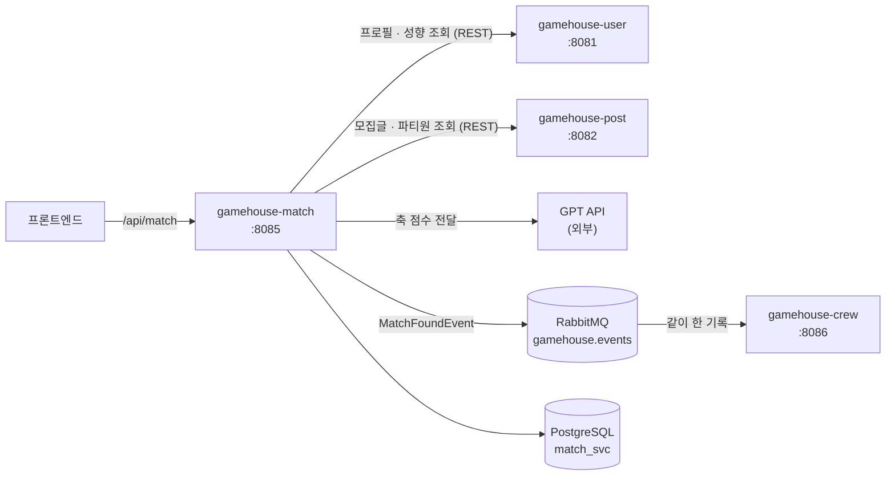

# gamehouse-match

GameHouse의 **AI Team Fit 추천** 서비스. 조건에 맞는 모집글을 추린 뒤
9개 축으로 적합도를 계산해 순위를 매기고, 1위 파티에는 GPT로 자연어 설명을 붙여 돌려준다.

---

## 1. 좌표

GameHouse는 서비스별로 레포가 분리된 MSA다. 이 레포는 그중 `match` 하나다.

| 서비스 | 포트 | 담당 |
|---|---|---|
| `gamehouse-user` | 8081 | 회원·인증·친구·알림 |
| `gamehouse-post` | 8082 | 모집글·파티 |
| `gamehouse-chat` | 8083 | 1:1 · 파티 채팅 |
| `gamehouse-riot` | 8084 | Riot API 연동 |
| **`gamehouse-match`** | **8085** | **AI Team Fit 추천** |
| `gamehouse-crew` | 8086 | 하우스(크루) |

공통 코드(JWT 검증, 전역 예외 처리, 이벤트 계약)는 `gamehouse-common`을
GitHub Packages에서 받아 쓴다. 배포 매니페스트는 `infra` 레포에 있다.

---

## 2. 서비스 관계도

**점수와 순위는 전부 백엔드가 정한다.** GPT에는 계산이 끝난 축 점수만 넘기고,
그것을 사람이 읽을 문장으로 바꾸는 일만 맡긴다. 3초 안에 응답이 없거나 실패하면
규칙 기반 문구로 대체되므로 AI가 죽어도 추천 기능은 그대로 동작한다.

user·post의 테이블을 직접 조회하지 않고 REST로만 물어본다.
match가 소유하는 것은 검색 요청·결과·설문 응답 스냅샷뿐이다.

---

## 3. 담당 도메인

| 도메인 | 하는 일 |
|---|---|
| **Hard Filter** | 포지션·티어·정원·마이크·인원·플레이 스타일로 후보를 추린다 |
| **Team Fit v3** | 9개 축(합계 100점)으로 적합도 계산 · 파티원 각각과 비교해 평균 |
| **정렬 · Top N** | 점수 내림차순으로 자르고 호출 시점 스냅샷으로 저장 |
| **AI 설명** | 1위 파티의 축 점수를 GPT에 넘겨 요약·근거·주의 문구 생성 |
| **추천 기록** | 사용자가 추천 결과에 어떻게 반응했는지 이벤트로 적재 |
